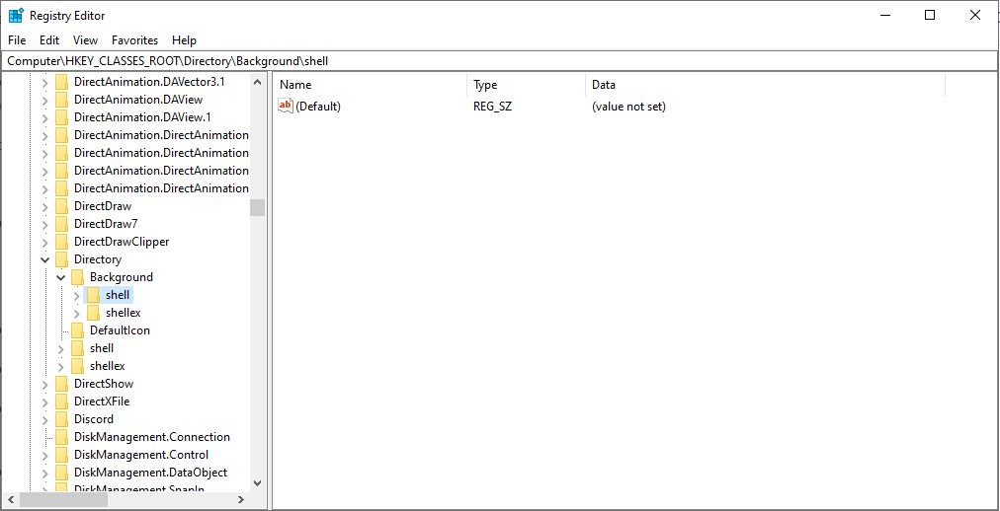
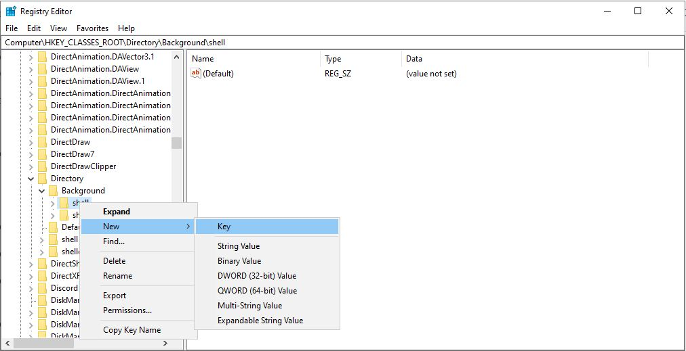
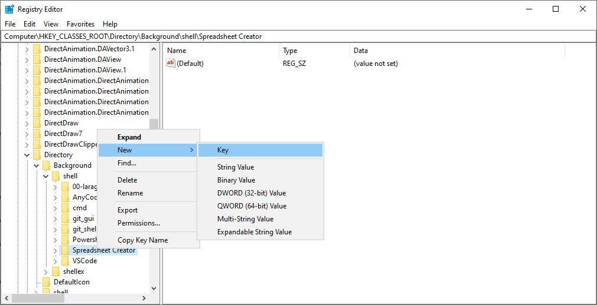
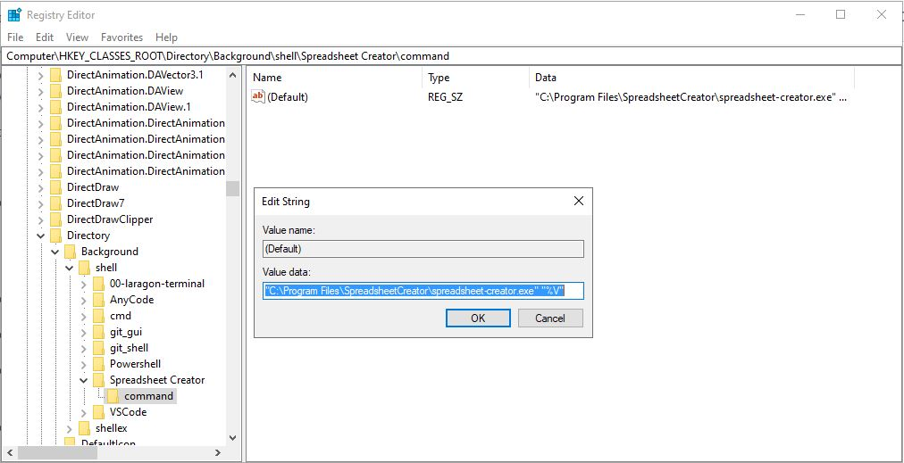
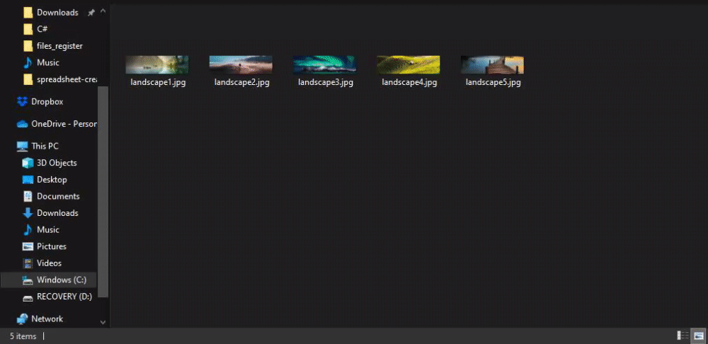
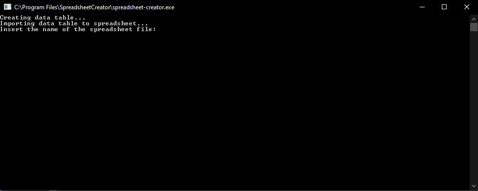
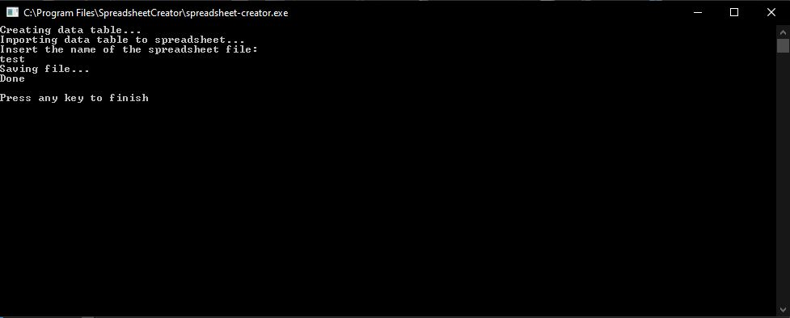
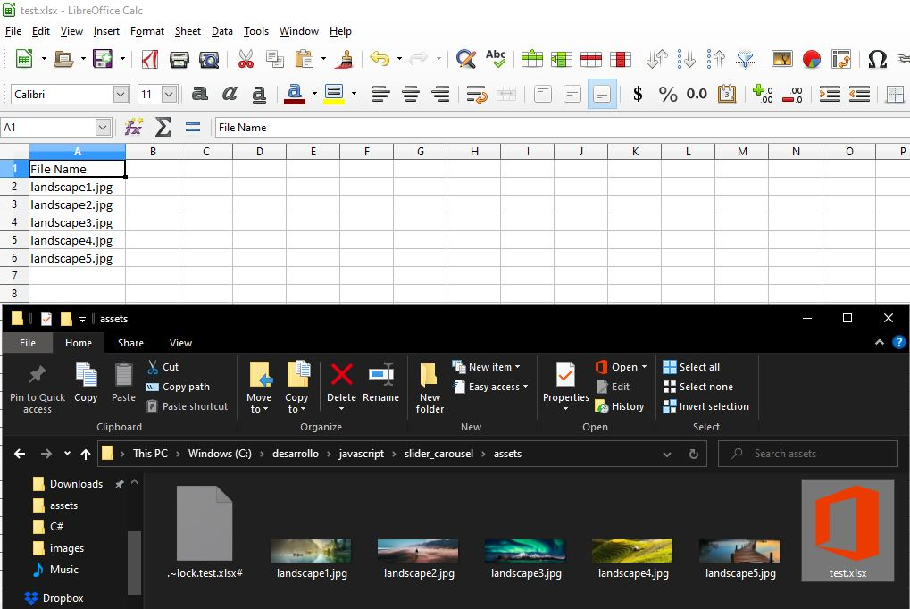

# spreadsheet-creator-netcore-console-app

Spreadsheet Creator is a .NET Core Console Application that allows you to create a spreadsheet listing the files of any folder.

Have you ever had to catalog all files inside a folder?. With Spreadsheet Creator you'll be able to create an inventory of all your files inside a folder by right clicking on any 
empty space inside the selected folder and clicking an option in the Windows Context Menu created specifically for this application. This option will launch Spreadsheet Creator and will read 
all the files and create a spreadsheet with the name of these files making the task of cataloguing files a little bit easier.

## How to use Spreadsheet Creator

Since there is no Windows Installer that sets the Context Menu option for the user and place the application in a given folder as of right now the user will have to create the 
option manually for the Windows Context Menu to display it and publish the build for this application and place it wherever the user wants. Just bear in mind you'll have to copy
the path of the .EXE file.

Don't panic, It's not as difficult as it seems :wink:

In the registration editor (regedit.exe):
- Find:
  1. HKEY_CLASSES_ROOT\Directory\Background\shell -> if you are administrator
  2. HKEY_CURRENT_USER\Software\Classes\directory\shell -> if you are a normal windows user

- Add a new key under shell and name it Spreadsheet Creator or any other name you want for the context menu item

- Add a new key inside this key you've just created inside shell and name it command (mandatory name)

- Edit the default property in command to "myprogrampath\executable.exe" "%V" to pass the background folder path to Spreadsheet Creator as a parameter

- Done. Now you should be able to see the option in the windows context menu when clicking on any empty space in a folder of your choice and now you can use the application as intended.

Once you run the application you will need to type a name for the spreadsheet file.

And the spreadsheet file will be created

